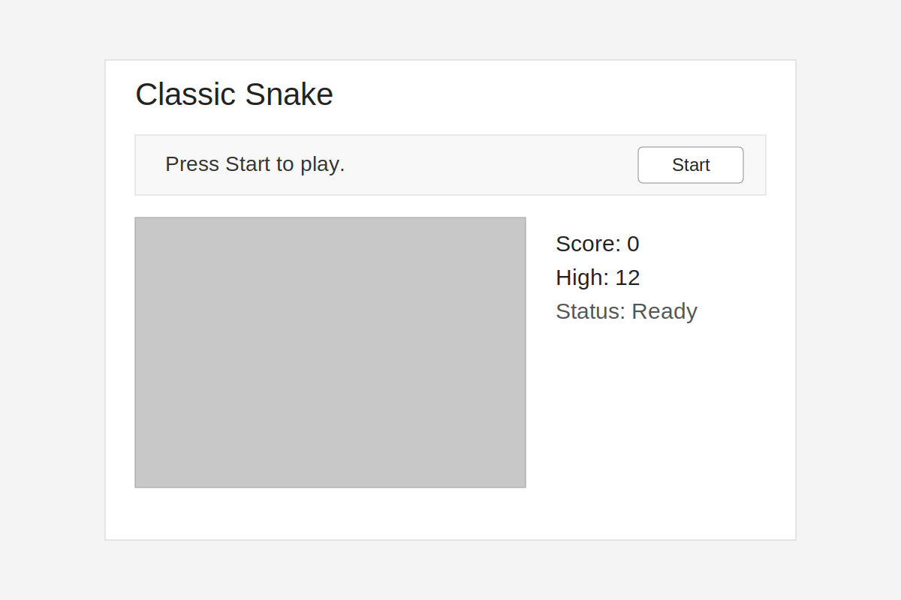
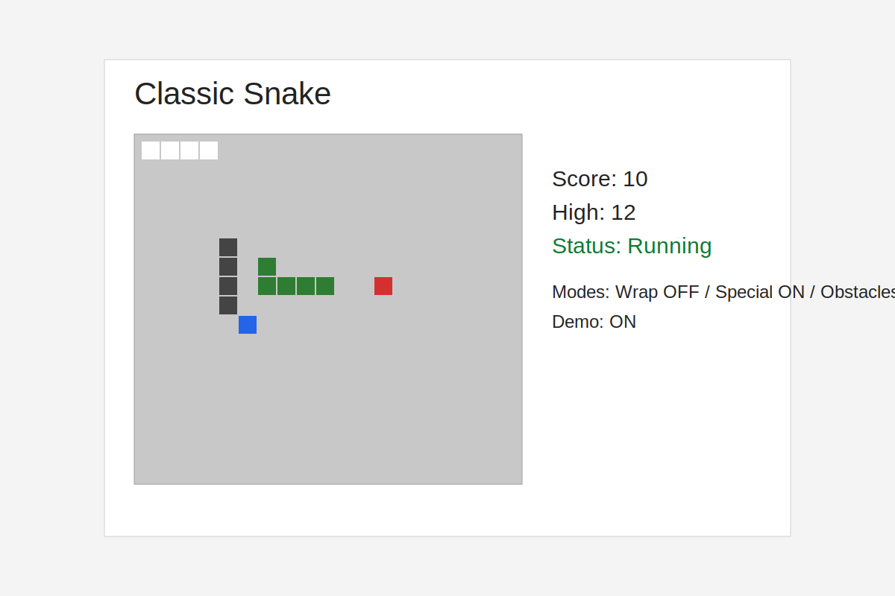
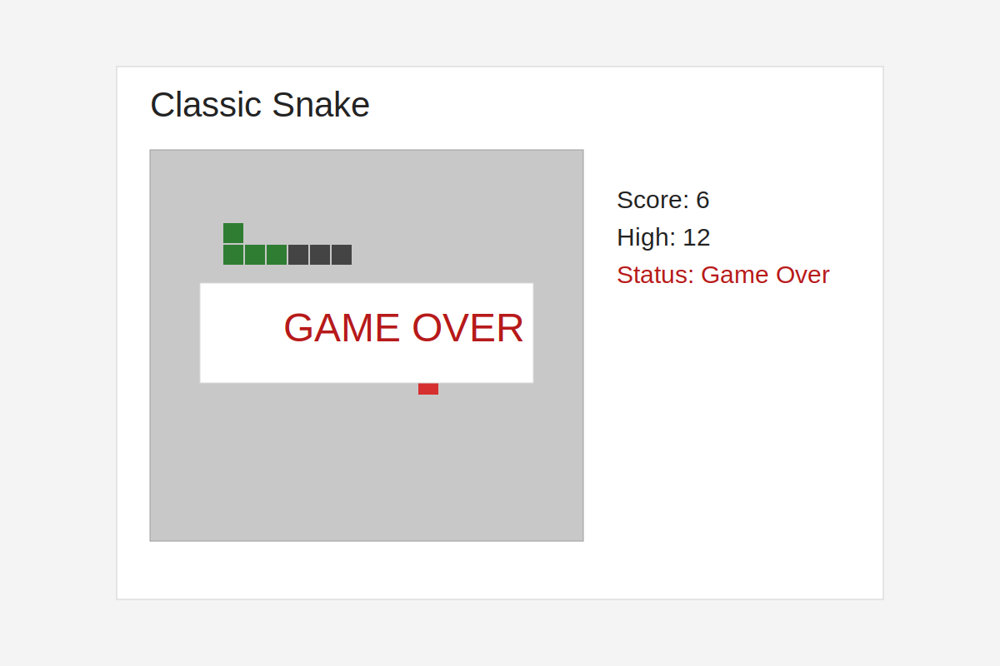

# 經典貪吃蛇（Classic Snake）

使用純 HTML / CSS / JavaScript 實作的模組化貪吃蛇遊戲。

## 遊戲玩法

- 在 20x20 格子地圖中移動蛇。
- 吃到紅色食物可成長並加分。
- 避開牆壁、自己身體，以及障礙物（啟用障礙模式時）。
- 按下 Restart 可完整重置分數、速度與方向。

## 操作方式

- 鍵盤：`方向鍵` 或 `W/A/S/D`
- 螢幕按鈕：`Up / Left / Down / Right`
- `Start`：開始遊戲
- `Pause/Resume`：暫停 / 繼續
- `Restart`：立即重開
- `Demo: ON/OFF`：AI 自動遊玩（BFS）

## 功能清單

- 依分數提升難度（速度變化）
- `localStorage` 最高分保存
- 特殊食物模式（減速效果）
- 穿牆模式（Wrap Walls）
- 障礙物模式（Obstacles）
- Demo 模式（BFS 路徑尋找）
- 可脫離 DOM 的核心邏輯測試

## 開發方式

### 本機啟動

```bash
cd F:\Codex\classicSnakegame
python -m http.server 8000
```

開啟：`http://localhost:8000`

### 執行測試

```bash
node --test src/snakeCore.test.js
```

## GitHub Pages 發佈

此專案已包含 Pages 自動部署流程（GitHub Actions），會從專案根目錄發佈靜態檔案。

### 一次性設定

1. 將此專案推送到 GitHub。
2. 到 Repository Settings -> **Pages**。
3. Source 設定為 **GitHub Actions**。

完成後，每次 push 到 `main` 都會自動部署。

## 截圖

開始畫面：



遊戲進行中：



遊戲結束：


